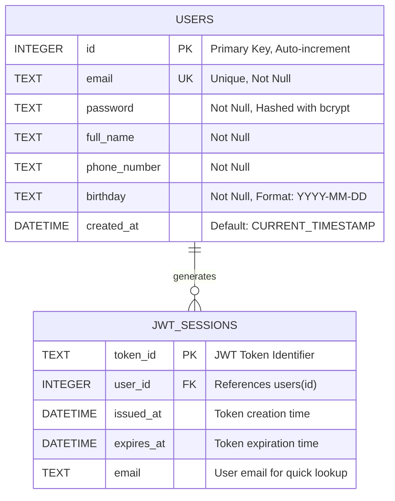
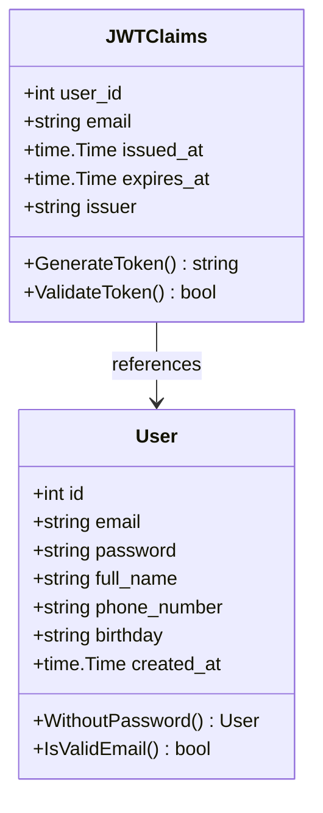
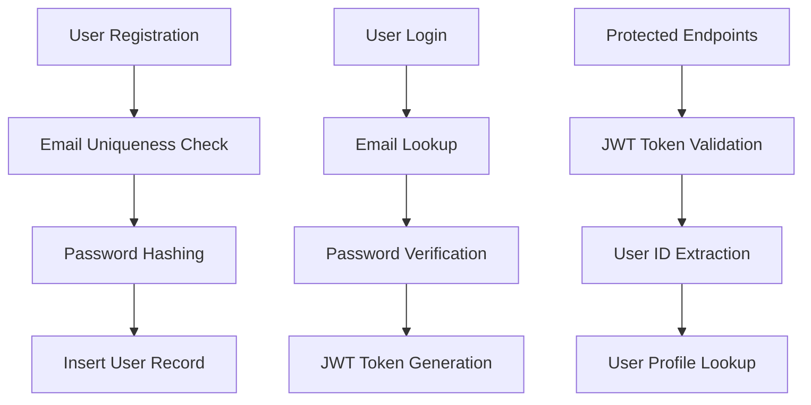
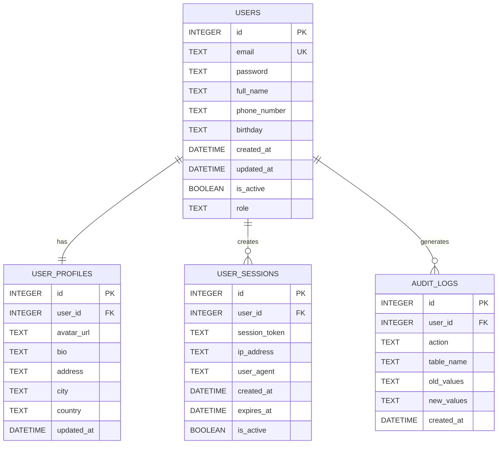

# Database Architecture

This document describes the database architecture for the Fiber Authentication API using Entity-Relationship diagrams and detailed schema documentation.

## 🏗️ Database Overview

The application uses **SQLite** as the primary database with a simple, focused schema designed around user authentication and management. The database follows clean architecture principles with clear separation between domain entities and infrastructure implementation.

## 📊 Entity Relationship Diagram



## 🗄️ Database Schema Details

### Users Table

The `users` table is the core entity storing user account information with authentication details.

```sql
CREATE TABLE IF NOT EXISTS users (
    id INTEGER PRIMARY KEY AUTOINCREMENT,
    email TEXT UNIQUE NOT NULL,
    password TEXT NOT NULL,
    full_name TEXT NOT NULL,
    phone_number TEXT NOT NULL,
    birthday TEXT NOT NULL,
    created_at DATETIME DEFAULT CURRENT_TIMESTAMP
);
```

#### Field Specifications

| Field | Type | Constraints | Description |
|-------|------|-------------|-------------|
| `id` | INTEGER | PRIMARY KEY, AUTOINCREMENT | Unique identifier for each user |
| `email` | TEXT | UNIQUE, NOT NULL | User's email address (used for login) |
| `password` | TEXT | NOT NULL | Hashed password using bcrypt |
| `full_name` | TEXT | NOT NULL | User's full name |
| `phone_number` | TEXT | NOT NULL | User's phone number |
| `birthday` | TEXT | NOT NULL | User's birth date (YYYY-MM-DD format) |
| `created_at` | DATETIME | DEFAULT CURRENT_TIMESTAMP | Account creation timestamp |

#### Indexes

```sql
-- Automatic index on primary key
CREATE UNIQUE INDEX idx_users_id ON users(id);

-- Automatic index on unique email
CREATE UNIQUE INDEX idx_users_email ON users(email);
```

### JWT Sessions (Virtual/Logical Entity)

While not physically stored in the database, JWT tokens represent sessions with the following logical structure:



## 🔄 Database Operations

### CRUD Operations

#### Create User
```sql
INSERT INTO users (email, password, full_name, phone_number, birthday, created_at)
VALUES (?, ?, ?, ?, ?, ?)
RETURNING id;
```

#### Read User
```sql
-- By Email (Login)
SELECT id, email, password, full_name, phone_number, birthday, created_at 
FROM users 
WHERE email = ?;

-- By ID (Profile)
SELECT id, email, password, full_name, phone_number, birthday, created_at 
FROM users 
WHERE id = ?;
```

#### Update User
```sql
UPDATE users 
SET email = ?, full_name = ?, phone_number = ?, birthday = ?
WHERE id = ?;
```

#### Delete User
```sql
DELETE FROM users 
WHERE id = ?;
```

## 🔐 Security Features

### Password Security
- All passwords are hashed using **bcrypt** before storage
- Plain text passwords are never stored in the database
- Password field is omitted from API responses using `WithoutPassword()` method

### Email Uniqueness
- Email field has UNIQUE constraint to prevent duplicate accounts
- Email validation is performed at both application and database levels

### JWT Token Security
- Tokens are stateless and contain user identification claims
- Tokens expire after 24 hours for security
- Token validation includes signature verification

## 📈 Database Statistics and Constraints

### Performance Considerations



### Constraints Summary

| Constraint Type | Field | Description |
|----------------|--------|-------------|
| Primary Key | `users.id` | Ensures unique user identification |
| Unique | `users.email` | Prevents duplicate email addresses |
| Not Null | `users.email` | Email is required for authentication |
| Not Null | `users.password` | Password is required for security |
| Not Null | `users.full_name` | Full name is required for user profile |
| Not Null | `users.phone_number` | Phone number is required |
| Not Null | `users.birthday` | Birthday is required |

## 🚀 Future Database Enhancements

### Potential Extensions



### Planned Features
- **User Profiles**: Extended user information and preferences
- **Session Management**: Track active user sessions
- **Audit Logging**: Track user actions and data changes
- **Role-Based Access**: User roles and permissions system
- **User Status**: Active/inactive user status management

## 🔧 Database Maintenance

### Backup Strategy
```bash
# SQLite backup
sqlite3 users.db ".backup backup_users_$(date +%Y%m%d).db"
```

### Migration Strategy
- Use versioned migration files
- Implement rollback capabilities
- Test migrations on staging environment first

### Monitoring Queries
```sql
-- User count
SELECT COUNT(*) as total_users FROM users;

-- Recent registrations
SELECT COUNT(*) as new_users_today 
FROM users 
WHERE DATE(created_at) = DATE('now');

-- Email domain distribution
SELECT 
    SUBSTR(email, INSTR(email, '@') + 1) as domain,
    COUNT(*) as count
FROM users 
GROUP BY domain 
ORDER BY count DESC;
```

This database architecture provides a solid foundation for the authentication system while remaining simple and scalable for future enhancements.
